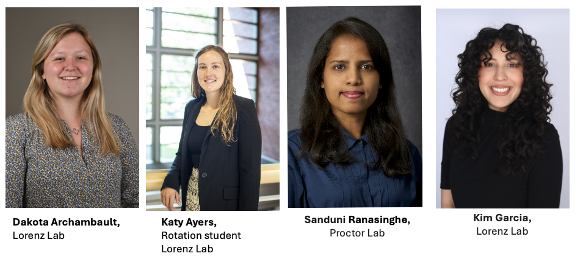

<h1 style="font-size:2.5em; text-align:center;">
  22nd Annual South Central Medical Mycology
</h1>
<h1 style="font-size:2.5em; text-align:center; margin-top:0;">
  (SCMM 2025) Meeting
</h1>

  

<strong>Dates:</strong> Thursday–Friday, <strong>November 20–21, 2025</strong>

Welcome, SCMM community! We’re excited to host the <strong>22nd Annual SCMM</strong> in Houston, TX.

This year, we are introducing a new <strong>trainee networking event</strong>: a bag-lunch session on Thursday designed to connect trainees with professionals across venture capital, bench science, science writing, and academia. Details will be emailed to registered trainees.

<h2>Quick links &amp; deadlines</h2>
<ul>
  <li><strong>Register by October 17, 2025:</strong> <a href="https://redcap.sph.uth.edu/surveys/?s=RAMYDRL4AAWHHYKJ">Register »</a></li>
  <li><strong>Submit your abstract by November 7, 2025:</strong> <a href="https://redcap.sph.uth.edu/surveys/?s=FYPJAHTFN8M8XNNH">Submit abstract »</a></li>
  <li><strong>Special hotel rate $149 — book by November 15, 2025:</strong> <a href="https://www.marriott.com/event-reservations/reservation-link.mi?id=1756991742828&key=GRP&app=resvlink">Book hotel »</a></li>
  <li>Please <strong>share</strong> with trainees and colleagues!</li>
</ul>

<h2>Venue</h2>

<strong>BRC (BioScience Research Collaborative)</strong> 
6500 Main St., Houston, TX 77030 
Conference rooms: BRC Event Hall

<strong>Parking Information</strong>

We strongly encourage attendees to walk or park at the conference hotel whenever possible. Limited parking is available at the BRC Garage for those who need it, but spaces are not guaranteed. For evening festivities, a shuttle will run between the BRC, Valhalla, and Hungry’s, and back to the hotel, so cars are not needed at the conference venue Our student ambassadors will also be there to help escort those who wish to walk to dinner. Everything is in close proximity. 

<strong>BRC Garage Details</strong>

For those who wish to park at BRC, the garage entrance is located off <strong>Dryden Rd.</strong> Parking is <strong>credit-card only</strong>:

<ul>
  <li>Insert your credit card at the entrance gate to enter (your card acts as a placeholder; no charge until exit).</li>
  <li>Park in any available space and take the elevator to the <strong>first floor</strong> of the BRC.</li>
  <li>Use the same credit card at the exit gate to pay when leaving.</li>
  <li>Press the call button at the gate for any issues.</li>
</ul>

<h2>Lodging (Room Block: “SCMM”)</h2>

<strong>Houston Marriott Medical Center / Museum District</strong> 
6580 Fannin Street (entrance at <strong>1730 Dryden Rd</strong>), Houston, TX 77030 
<strong>Phone:</strong> (713) 796-0080 
<strong>Rate:</strong> <strong>$149</strong> (book by <strong>Nov 15, 2025</strong>) — 
<a href="https://www.marriott.com/event-reservations/reservation-link.mi?id=1756991742828&key=GRP&app=resvlink">Book hotel »</a>

<h3><u>Thursday, November 20</u></h3>
<table style="border-collapse:collapse; width:100%;">
  <tr>
    <td style="width:25%; padding:6px; text-align:right; font-weight:bold; white-space:nowrap;">11:00 AM – 12:45 PM</td>
    <td style="padding:6px;"><em>Trainee Networking &amp; Career Development Brunch</em> (bag lunch provided)</td>
  </tr>
  <tr>
    <td style="text-align:right; font-weight:bold; padding:6px;">1:00 – 1:10 PM</td>
    <td style="padding:6px;">Opening remarks (Perez &amp; Lorenz)</td>
  </tr>
  <tr>
    <td style="text-align:right; font-weight:bold; padding:6px;">1:10 – 2:40 PM</td>
    <td style="padding:6px;"><strong>Session I:</strong> Host responses to fungal pathogens (Chair: Karen Wozniak)</td>
  </tr>
  <tr>
    <td style="text-align:right; font-weight:bold; padding:6px;">2:40 – 3:00 PM</td>
    <td style="padding:6px;">Coffee break &amp; networking</td>
  </tr>
  <tr>
    <td style="text-align:right; font-weight:bold; padding:6px;">3:00 – 4:30 PM</td>
    <td style="padding:6px;"><strong>Session II:</strong> Fungal biofilms &amp; antifungal resistance (Chair: Bao Vu)</td>
  </tr>
  <tr>
    <td style="text-align:right; font-weight:bold; padding:6px;">4:30 – 4:45 PM</td>
    <td style="padding:6px;">Coffee break &amp; networking</td>
  </tr>
  <tr>
    <td style="text-align:right; font-weight:bold; padding:6px;">4:45 – 5:45 PM</td>
    <td style="padding:6px;"><strong>Keynote:</strong> Dr. Deborah Hogan, Professor, Dartmouth</td>
  </tr>

  <!-- INSERTED SHUTTLE EVENTS HERE (chronologically before the 6 PM reception) -->
  <tr>
    <td style="text-align:right; font-weight:bold; padding:6px;">6:00 PM</td>
    <td style="padding:6px;">Bus departs from the BRC (75-person meeting) to Keck Hall/Valhalla. Remaining attendees may walk to Keck Hall/Valhalla or return to the hotel.</td>
  </tr>

  <tr>
    <td style="text-align:right; font-weight:bold; padding:6px;">6:00 – 7:15 PM</td>
    <td style="padding:6px;">Reception — Valhalla, 6100 Main St, Houston, TX 77005</td>
  </tr>

  <tr>
    <td style="text-align:right; font-weight:bold; padding:6px;">7:00 PM</td>
    <td style="padding:6px;">Bus takes 30 scientists from the Marriott Hotel (6580 Fannin Street), or from the BRC, to Hungry’s Restaurant (2356 Rice Blvd).</td>
  </tr>

  <tr>
    <td style="text-align:right; font-weight:bold; padding:6px;">7:15 PM</td>
    <td style="padding:6px;">Bus takes 30 scientists from Keck Hall/Valhalla to Hungry’s Restaurant.</td>
  </tr>

  <tr>
    <td style="text-align:right; font-weight:bold; padding:6px;">7:30 – 9:30 PM</td>
    <td style="padding:6px;">Dinner — Hungry’s Café, 2356 Rice Blvd</td>
  </tr>

  <tr>
    <td style="text-align:right; font-weight:bold; padding:6px;">9:15 PM</td>
    <td style="padding:6px;">Bus takes 30 scientists from Hungry’s Restaurant to the Marriott Hotel.</td>
  </tr>
</table>

<h2>Career Development &amp; Networking</h2>
<ul>
  <li>
    <strong>Trainee Bag-Lunch (Thu 11:00 AM):</strong> 
    Curated tables with mentors from VC, industry/bench science, science writing, and academia. 
    <a href="SCMM2025NetworkingPrimer.docx" target="_blank" rel="noopener">Networking Tips &amp; Tricks (SCMM 2025 Primer)</a>
    &nbsp;|&nbsp;
    <a href="SCMM_Bios-2.docx" target="_blank" rel="noopener">Speaker Bios (SCMM_Bios-2.docx)</a>
  </li>
  <li>
    <strong>Career Panel (Fri 2:00 PM):</strong> 
    Perspectives on non-academic trajectories, Q&amp;A.
  </li>
</ul>

<h2>Keynote Speaker</h2>

  <strong>
    <a href="https://geiselmed.dartmouth.edu/faculty/facultydb/view.php/?uid=2817" target="_blank" rel="noopener">
      Dr. Deborah A. Hogan
    </a>
  </strong> 
  Professor, Dartmouth 
  <em>Talk title to be announced.</em>

<h2>Session Chairs</h2>

  <ul>
    <li><strong>Luis Vega</strong> — Research Assistant Professor, UTHealth Houston McGovern Medical School</li>
    <li><strong>Pedro Miramón</strong> — Research Assistant Professor, The University of Texas Health Science Center at Houston</li>
    <li><strong>Karen Wozniak</strong> — Associate Professor, Oklahoma State University</li>
    <li><strong>Jesús Romo</strong> — Assistant Professor, UT San Antonio</li>
    <li><strong>Bao Vu</strong> — Assistant Professor, University of Oklahoma Health Sciences Center</li>
    <li><strong>Alison Coady</strong> — Assistant Professor, University of Texas Medical Branch at Galveston</li>
  </ul>

<h2>Presentation Judges</h2>

  <strong>Postdoctoral Presentation Judges</strong>
  <ul>
    <li><strong>Karen Wozniak</strong> — Associate Professor, Department of Microbiology &amp; Molecular Genetics, Oklahoma State University</li>
    <li><strong>Pedro Miramón</strong> — Research Assistant Professor, Department of Microbiology &amp; Molecular Genetics, McGovern Medical School, The University of Texas Health Science Center at Houston</li>
    <li><strong>David Kadosh</strong> — Professor, Department of Microbiology, Immunology &amp; Molecular Genetics, The University of Texas Health Science Center at San Antonio</li>
  </ul>

  <strong>Student Presentation Judges</strong>
  <ul>
    <li><strong>Alison Coady</strong> — Assistant Professor, University of Texas Medical Branch at Galveston</li>
    <li><strong>Brian Peters</strong> — Assistant Professor, Department of Clinical Pharmacy and Translational Science, The University of Tennessee Health Science Center</li>
    <li><strong>P. David Rogers</strong> — Chair, Department of Pharmacy and Pharmaceutical Sciences; St. Jude Endowed Chair in Pharmaceutical Sciences; St. Jude Children’s Research Hospital</li>
  </ul>

<h2>Student Ambassadors</h2>

Our UTHealth Houston Student Ambassadors to SCMM will assist with registration, run microphones during Q&amp;A sessions, help set up food, and support overall conference logistics.

<ul>
  <li><strong>Dakota Archambault</strong> — Fifth-year PhD student</li>
   <li><strong>Katy Ayers</strong> — First-year PhD student</li>
    <li><strong>Sanduni Ranasinghe </strong> — Second-year PhD student</li>
     <li><strong>Kimberly Garcia</strong> — Second-year PhD student</li>

</ul>

  

<h2>Organizing Team</h2>
<ul>
  <li><strong>Co-Chairs:</strong> Diana Proctor, Luis Vega, Christian Perez &amp; Michael Lorenz</li>
</ul>

<h2>Contact</h2>

Questions? Email Diana <strong>dinah.m.proctor@uth.tmc.edu</strong>.

<h2>Support &amp; Sponsorship</h2>

This meeting is subsidized through the generous support of the MD Anderson UTHealth Houston Graduate School of Biomedical Sciences, UTHealth McGovern Medical School, IMMY, LSU Health New Orleans School of Dentistry, St. Jude Children’s Research Hospital, Rice University, the University of Tennessee Health Science Center, the Mycological Society of the Americas (MMSA), and <em>npj</em> Fungal Sciences.

If you would like to make a donation, the Medical Mycological Society of the Americas (MMSA) is a co-sponsor and processes contributions for the conference. Donations can be made via the MMSA website using the PayPal button at <a href="https://mycologicalsociety.org/">https://mycologicalsociety.org/</a> (about halfway down the page, labeled “MMSA Donations”).

<em>Please indicate “SCMM 2025” in the comments so Dr. Karen Wozniak can track these separately from MMSA’s general funds.</em>

We look forward to celebrating <strong>22 years of SCMM</strong> with you in Houston!

<em>Last updated: {{ November 13, 2025 }}</em>

<!-- bottom logos -->

  

