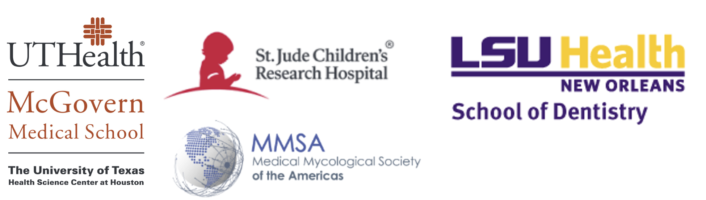

<h1 style="font-size:2.5em; text-align:center;">
  22nd Annual South Central Medical Mycology
</h1>
<h1 style="font-size:2.5em; text-align:center; margin-top:0;">
  (SCMM 2025) Meeting
</h1>

  

<strong>Dates:</strong> Thursday–Friday, <strong>November 20–21, 2025</strong> 

Welcome, SCMM community! We’re excited to host the <strong>22nd Annual SCMM</strong> in Houston, TX. 

This year, we are introducing a new <strong>trainee networking event</strong>: a bag-lunch session on Thursday designed to connect trainees with professionals across venture capital, bench science, science writing, and academia. Details will be emailed to registered trainees.

<h2>Quick links &amp; deadlines</h2>
<ul>
  <li><strong>Register by October 17, 2025:</strong> <a href="https://redcap.sph.uth.edu/surveys/?s=RAMYDRL4AAWHHYKJ">Register »</a></li>
  <li><strong>Submit your abstract by November 7, 2025:</strong> <a href="https://redcap.sph.uth.edu/surveys/?s=FYPJAHTFN8M8XNNH">Submit abstract »</a></li>
  <li><strong>Special hotel rate $149 — book by November 15, 2025:</strong> <a href="https://www.marriott.com/event-reservations/reservation-link.mi?id=1756991742828&key=GRP&app=resvlink">Book hotel »</a></li>
  <li>Please <strong>share</strong> with trainees and colleagues!</li>
</ul>

<h2>Venue</h2>

<strong>BRC (BioScience Research Collaborative)</strong> 
6500 Main St., Houston, TX 77030 

<strong>Conference rooms:</strong> Posted onsite at check-in 

<h2>Lodging (Room Block: “SCMM”)</h2>

<strong>Houston Marriott Medical Center / Museum District</strong> 
6580 Fannin Street (entrance at <strong>1730 Dryden Rd</strong>), Houston, TX 77030 
<strong>Phone:</strong> (713) 796-0080 
<strong>Rate:</strong> <strong>$149</strong> (book by <strong>Nov 15, 2025</strong>) — <a href="https://www.marriott.com/event-reservations/reservation-link.mi?id=1756991742828&key=GRP&app=resvlink">Book hotel »</a>

<h2>Schedule at a Glance</h2>

<em>The schedule below is tentative and subject to change.</em>

<h3><u>Thursday, November 20</u></h3>
<table style="border-collapse:collapse; width:100%;">
  <tr>
    <td style="width:25%; padding:6px; text-align:right; font-weight:bold; white-space:nowrap;">11:00 AM – 1:00 PM</td>
    <td style="padding:6px;"><em>Trainee Networking &amp; Career Development Lunch</em> (bag lunch provided)</td>
  </tr>
  <tr>
    <td style="text-align:right; font-weight:bold; padding:6px;">1:00 – 1:10 PM</td>
    <td style="padding:6px;">Opening remarks (Perez &amp; Lorenz)</td>
  </tr>
  <tr>
    <td style="text-align:right; font-weight:bold; padding:6px;">1:10 – 2:40 PM</td>
    <td style="padding:6px;"><strong>Session I:</strong> Host responses to fungal pathogens</td>
  </tr>
  <tr>
    <td style="text-align:right; font-weight:bold; padding:6px;">2:40 – 3:00 PM</td>
    <td style="padding:6px;">Coffee break &amp; networking</td>
  </tr>
  <tr>
    <td style="text-align:right; font-weight:bold; padding:6px;">3:00 – 4:30 PM</td>
    <td style="padding:6px;"><strong>Session II:</strong> Fungal biofilms &amp; antifungal resistance</td>
  </tr>
  <tr>
    <td style="text-align:right; font-weight:bold; padding:6px;">4:30 – 4:45 PM</td>
    <td style="padding:6px;">Coffee break &amp; networking</td>
  </tr>
  <tr>
    <td style="text-align:right; font-weight:bold; padding:6px;">4:45 – 5:45 PM</td>
    <td style="padding:6px;"><strong>Keynote:</strong> Dr. Deborah Hogan, Professor, Dartmouth</td>
  </tr>
  <tr>
    <td style="text-align:right; font-weight:bold; padding:6px;">6:00 – 7:15 PM</td>
    <td style="padding:6px;">Reception — Valhalla (Rice’s graduate student pub)</td>
  </tr>
  <tr>
    <td style="text-align:right; font-weight:bold; padding:6px;">7:30 – 9:30 PM</td>
    <td style="padding:6px;">Dinner — Hungry’s Café, 2356 Rice Blvd</td>
  </tr>
</table>

<h3><u>Friday, November 21</u></h3>
<table style="border-collapse:collapse; width:100%;">
  <tr>
    <td style="width:25%; padding:6px; text-align:right; font-weight:bold; white-space:nowrap;">8:30 – 9:45 AM</td>
    <td style="padding:6px;"><strong>Session III:</strong> Antifungal drug discovery &amp; novel therapeutics</td>
  </tr>
  <tr>
    <td style="text-align:right; font-weight:bold; padding:6px;">9:45 – 10:15 AM</td>
    <td style="padding:6px;">New PI elevator talks (5–6 min each)</td>
  </tr>
  <tr>
    <td style="text-align:right; font-weight:bold; padding:6px;">10:15 – 10:40 AM</td>
    <td style="padding:6px;">Coffee break &amp; networking</td>
  </tr>
  <tr>
    <td style="text-align:right; font-weight:bold; padding:6px;">10:40 – 11:55 AM</td>
    <td style="padding:6px;"><strong>Session IV:</strong> Fungal pathogenesis</td>
  </tr>
  <tr>
    <td style="text-align:right; font-weight:bold; padding:6px;">12:00 – 12:50 PM</td>
    <td style="padding:6px;">Lunch (provided)</td>
  </tr>
  <tr>
    <td style="text-align:right; font-weight:bold; padding:6px;">1:00 – 2:00 PM</td>
    <td style="padding:6px;"><strong>Session V:</strong> Novel diagnostic strategies for fungal infections</td>
  </tr>
  <tr>
    <td style="text-align:right; font-weight:bold; padding:6px;">2:00 – 3:00 PM</td>
    <td style="padding:6px;"><em>Career Development Panel</em> (non-academic paths)</td>
  </tr>
  <tr>
    <td style="text-align:right; font-weight:bold; padding:6px;">3:00 – 3:15 PM</td>
    <td style="padding:6px;">Awards &amp; business meeting (conference close)</td>
  </tr>
</table>

<h2>Career Development & Networking</h2>
<ul>
  <li><strong>Trainee Bag-Lunch (Thu 11:00 AM):</strong> Curated tables with mentors from VC, industry/bench science, science writing, and academia.  
 <a href="SCMM_2025_Networking_Primer_for_Trainees_DP.docx"
   target="_blank" rel="noopener">
   Networking Tips & Tricks (SCMM 2025 Primer)
</a>
  </li>

  <li><strong>Career Panel (Fri 2:00 PM):</strong> Perspectives on non-academic trajectories, Q&A.  
      <a href="SCMM_Bios-2.docx" target="_blank" rel="noopener" style="margin-left:8px;">
        Speaker Bios (SCMM_Bios-2.docx)
      </a>
  </li>
</ul>

<h2>Keynote Speaker</h2>

<strong>Dr. Deborah A. Hogan</strong> 
Professor, Dartmouth 
<em>Talk title to be announced.</em>

<h2>Organizing Team</h2>
<ul>
  <li><strong>Co-Chairs:</strong> Diana Proctor, Luis Vega, Christian Perez &amp; Michael Lorenz</li>
  <li><em>Generous sponsors that have already made donations include: LSU Health New Orleans - School of Dentistry, The University of Tennessee Health Science Center, St. Jude Children’s Research Hospital, and the Mycological Society of the Americas (MMSA).</em></li>
</ul>

<h2>Support &amp; Sponsorship</h2>

The <strong>Medical Mycological Society of the Americas (MMSA)</strong> is a co-sponsor and is processing contributions for the conference. Donations can be made via the MMSA website using the PayPal button at <a href="https://mycologicalsociety.org/">https://mycologicalsociety.org/</a> (about halfway down the page, labeled “MMSA Donations”).

<em>Please indicate “SCMM 2025” in the comments so Dr. Karen Wozniak can track these separately from MMSA’s general funds.</em>

<h2>Contact</h2>

Questions? Email Diana <strong>dinah.m.proctor@uth.tmc.edu</strong>.

We look forward to celebrating <strong>22 years of SCMM</strong> with you in Houston!

<em>Last updated: {{ Sept. 26, 2025 }}</em>

<!-- bottom logos -->

  

