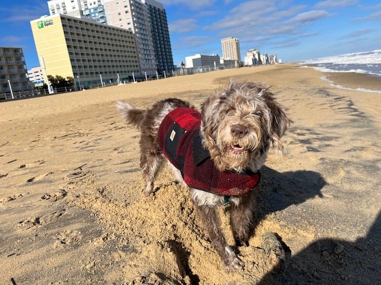

Individuals interested in exploring opportunities in our group should email a statement of interest along with a CV or resume to dinah.m.proctor at uth dot tmc dot edu.

<h3><strong>Diana M. Proctor, PhD</strong></h3>

  <strong>Principal Investigator</strong>

  A first generation college graduate and native of West Texas, Diana completed a B.A. at Hampshire College before earning a PhD in the Department of Microbiology & Immunology at Stanford University. She completed postdoctoral training in microbial genomics at the NIH prior to starting her Lab in October 2024.

  In her free time, she enjoys hiking, sitting under trees with her pup, and taking care of family.

  <strong>Email:</strong> <a href="mailto:dinah.m.proctor@uth.tmc.edu">dinah.m.proctor@uth.tmc.edu</a>

<h3><strong>Lucy Proctor</strong></h3>

  <strong>Principal Stick Investigator</strong>

  Meet Lucy, our Principal Stick Investigator. While we wrangle data in the lab, Lucy takes charge of sticks, snow, and sand with unmatched enthusiasm. Her playful spirit and unwavering loyalty bring joy to our team, reminding us to find balance in our work and play.

  In her free time, she enjoys games of fetch as well as swimming in lakes and the ocean.

