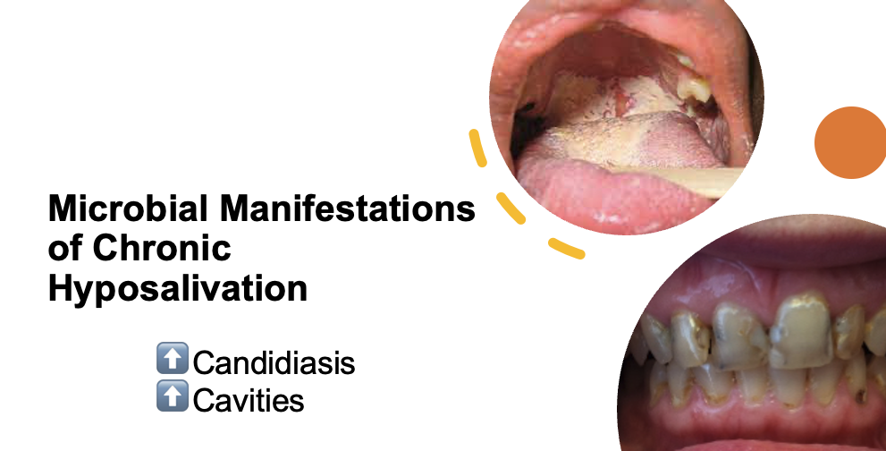
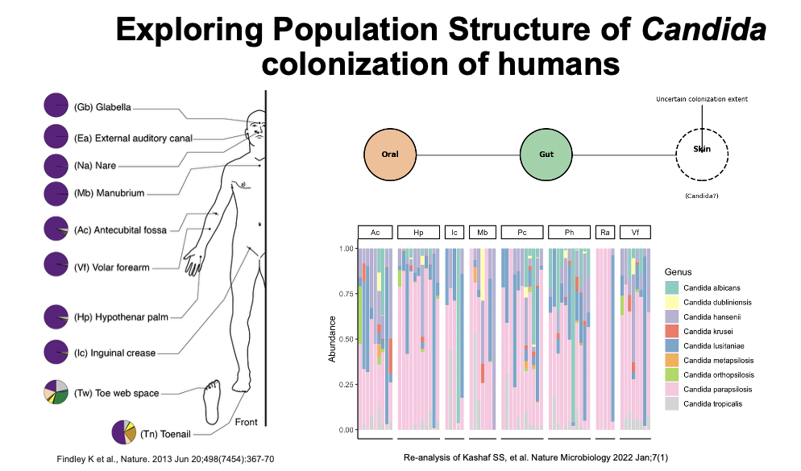
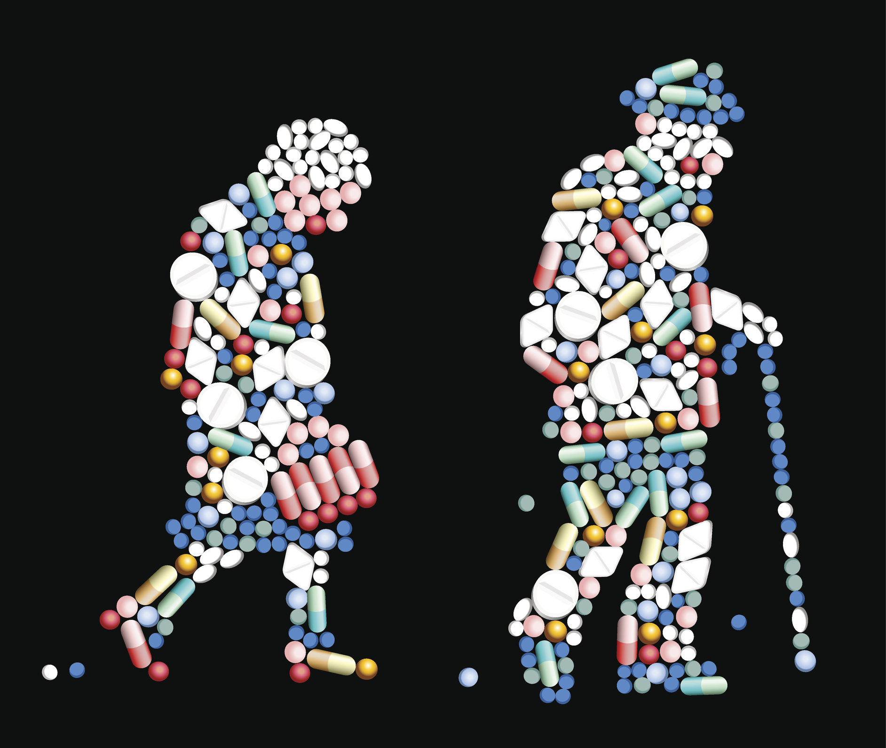

<em>Candida</em> is a common member of the human microbiome and typically exists as a harmless commensal. However, it is also the fourth leading cause of bloodstream infections in the U.S., with mortality rates exceeding 40%. Most infections originate from the host’s own microbiota, yet the factors that drive <em>Candida</em>’s transition from benign colonizer to virulent pathogen remain poorly understood.

Our lab aims to fill this gap by investigating how commonly used medications—through their unintended effects on the microbiome—alter host and pathogen physiology in ways that promote the rise of <em>Candida</em> to predominance within the microbiome. We integrate observational studies in humans and other animals with experimental evolution, single-cell genomics, stable isotope probing, and metabolomics to uncover how drugs impact the stability and resilience of the microbiome.

Across projects, we are unified by a central question: how do commonly prescribed medications contribute to microbiome destabilization—either by directly altering microbial fitness or by modifying host physiology in ways that favor the expansion of opportunistic organisms like <em>Candida</em>? By probing both microbial and host-level consequences, we aim to uncover general principles linking drug exposure to perturbations of the microbiome and disease risk.

<h3><strong>Project 1: Salivary Flow, <em>Candida</em>, and Oral Health</strong></h3>

  Hyposalivation—abnormally low salivary flow—is a common condition affecting a significant proportion of older adults. It is most prevalent among individuals who (1) take multiple medications, (2) have autoimmune disorders, (3) have undergone head or neck radiation, (4) have received chemotherapy, or (5) are over 60 years old. Despite its high prevalence, hyposalivation is often diagnosed late—on average, nine years after the first tooth is lost to disease—leading to worsened oral health outcomes.

  Chronic hyposalivation is associated with <em>Candida</em> carriage in the majority of affected individuals, increasing their risk of recurrent oral candidiasis. Recurrence may be exacerbated by the reduced bioactivity of two major antifungal drug classes at the acidic pH characteristic of dental caries. While an inverse relationship between salivary flow and <em>Candida</em> bioburden is established, little is known about <em>Candida</em>’s spatial distribution, persistence, or its role in the development of anterior caries.

  Our research aims to fill this gap by quantifying the relationships among salivary flow, <em>Candida</em>, the oral microbiome, and oral health. Our long term goal is to inform the development of novel, ecologically informed diagnostics and therapeutics.

<h3><strong>Project 2: Skin Moisture and the Skin Microbiome</strong></h3>

  We study the human skin microbiome across the lifespan, focusing on two key physiological factors: skin dryness and exfoliation rates. Our preliminary findings suggest that the skin is a more substantial reservoir for <em>Candida</em> colonization than previously recognized, which has important implications for infection control.Just as salivary flow rates likely shape microbiome dynamics of the oral cavity, we hypothesize that they affect microbiome dynamics on skin.

  By examining oral and skin microbial dynamics in relation to dryness, we aim to identify generalizable principles by which host physiological factors shape microbiome stability and resilience.

<h3><strong>Project 3: Impact of Common Medications on <em>Candida</em></strong></h3>

  We are interested in understanding how commonly prescribed medications impact <em>Candida</em> fitness. While many studies have examined the collateral effects of these drugs on the bacterial component of the microbiome, their impact on <em>Candida</em> remains largely unexplored. This is surprising, given that many medications have well-documented effects on mammalian cells and yeast serve as a key model system for human biology due to the high degree of conservation between them.

  We use a combination of drug interaction screens, RNA sequencing, and in vitro evolution approaches to understand how these drugs modulate <em>Candida</em> fitness, antifungal resistance, and virulence.

